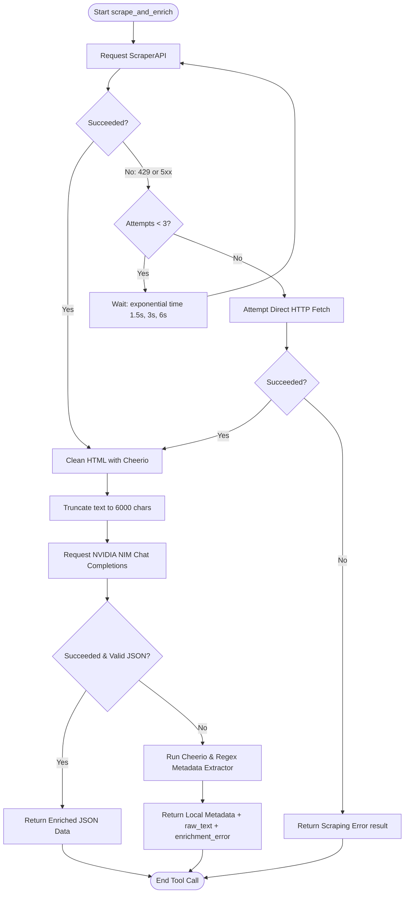
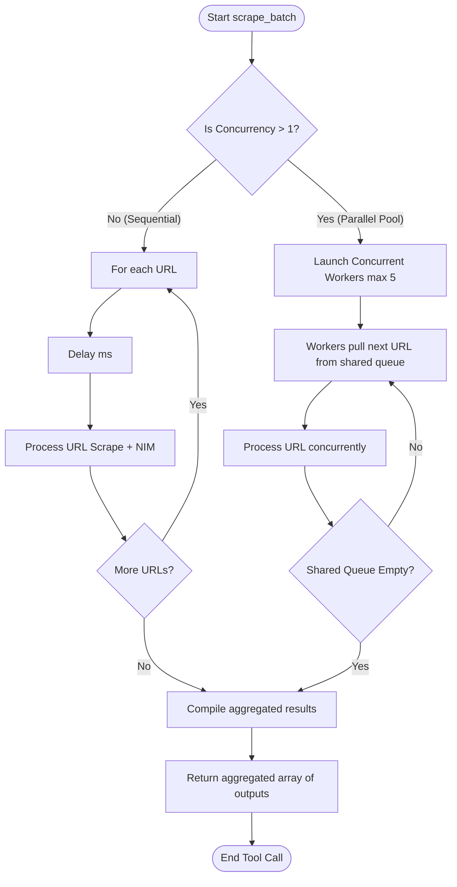
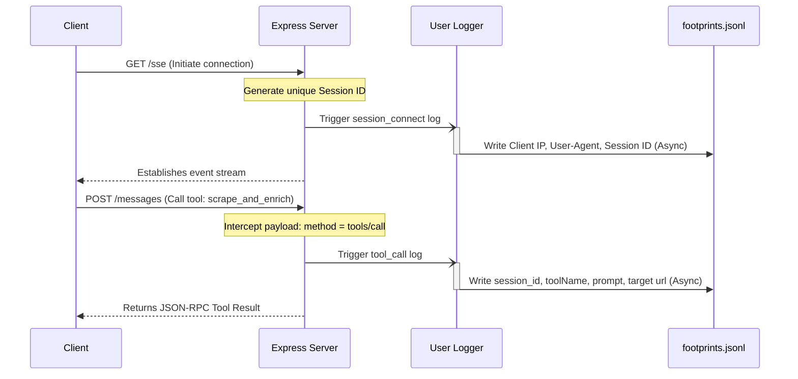

# System Architecture & Visual Flow - scraper-mcp

This document provides a visual representation of how the **scraper-mcp** server operates, detailing the communication flow, tool executions, and fallback handlers.

---

## 1. High-Level System Architecture

The following diagram shows the end-to-end data flow when Claude interacts with the MCP Server via SSE transport.

```mermaid
graph TD
    subgraph Claude Client
        Claude[Claude App / Desktop] <-->|JSON-RPC over HTTP/SSE| MCP_Client[MCP Client]
    end

    subgraph scraper-mcp Server (Railway)
        Express[Express App]
        SSE_Route[GET /sse <br> Establish stream]
        Msg_Route[POST /messages <br> Handle requests]
        McpServer[McpServer SDK Router]
        UserLogger[(user_footprints.jsonl)]
    end

    subgraph External APIs
        ScraperAPI[ScraperAPI REST API]
        NvidiaNIM[NVIDIA NIM Chat API]
    end

    %% Client Handshake
    MCP_Client -->|GET /sse| SSE_Route
    SSE_Route -.->|Establishes SSE Session| MCP_Client
    SSE_Route -->|Log session_connect| UserLogger

    %% Message Loop
    MCP_Client -->|POST /messages| Msg_Route
    Msg_Route -->|Log user footprint / tool_call| UserLogger
    Msg_Route -->|Forward JSON-RPC payload| McpServer

    %% Server Tool Logic
    McpServer -->|1. Request Scrape| ScraperAPI
    McpServer -->|2. Request Enrichment| NvidiaNIM

    %% Backoffs & Fallbacks
    ScraperAPI -.->|If fails: Direct Fetch| TargetWeb[Target Website]
    NvidiaNIM -.->|If fails: Fallback regex parser| LocalFallback[Local Regex / Tag Metadata Extractor]
```

---

## 2. Tool Execution Lifecycle: `scrape_and_enrich`

Below is the execution flow detailing the robust exponential backoffs and local fallback extractors in case of API outages.



---

## 3. Tool Execution Lifecycle: `scrape_batch`

Below is the visual flow of the concurrent batch processing queue.



---

## 4. How the Logging Footprint Works

Every network interaction is logged asynchronously (without blocking request execution) to preserve performance under concurrent load.


